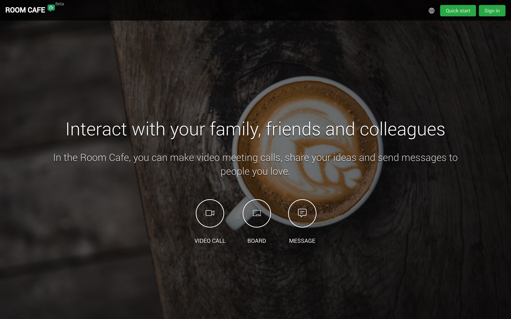
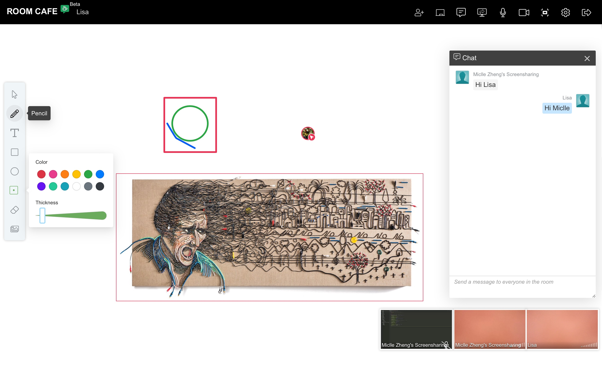

# Room.Cafe

## Room.Cafe Feature Descriptions

### Video Call
* Dramatically increase user engagement with Video calling.
* High quality, low-latency makes you as in a real meeting room.

 

### Board
* Real-time whiteboards is the easiest way to share inspirations with your team.
* Provide a variety of tools like images, texts, brushes, documents, screen sharing to express your ideas.

 

### Messaging

* Have a group chat to immediately diss your throughts.

 

### RTC
 https://agoraio-community.github.io/AgoraWebSDK-NG/zh-CN/  
[https://docs.agora.io/cn/Real-time-Messaging/API Reference/RTM_web/index.html](https://docs.agora.io/cn/Real-time-Messaging/API%20Reference/RTM_web/index.html)  
https://console.agora.io/  

### Whiteboard
https://developer.netless.link/docs/javascript/guide/js-sdk/  
https://netless.link/